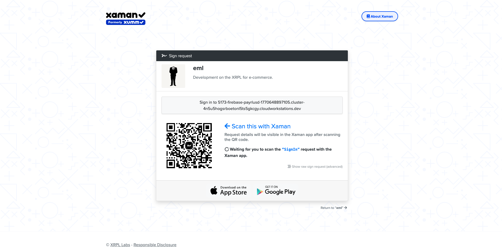

Xpay: Secure Medical Procurement via XRPL
A specialized Web3 application leveraging the Xaman (formerly Xumm) Universal SDK and Firebase to provide an identity-verified gateway for medical device procurement.

🚀 The Vision
Xpay aligns patient demographics (stored securely in Firestore) with blockchain-based transactions (executed on the XRPL). This ensures that every medical procurement is tied to a verified identity, providing a clear audit trail for healthcare providers.

The secure, Royal Blue entry point for authorized healthcare personnel.

🏗️ Architectural Flow
The application follows a strict logic path to ensure patient data is captured before any financial transaction is authorized:

## 📱 Interface Showcase
A look at the professional, Royal Blue healthcare portal and the real-time blockchain integration.

| User Experience (Live Flow) | Identity & Portal UI |
| :--- | :--- |
|  |  |
| *Live demonstration of the procurement and signing flow.* | *Verified portal access for Gabriel Casillas.* |

| Xaman Wallet Integration | Transaction Ledger |
| :--- | :--- |
|  |  |
| *Secure, non-custodial authorization via XRPL.* | *Auditable, real-time transaction history.* |

Code snippet
graph TD
    A[Landing Page] --> B{Google Auth}
    B --> C{Profile Exists in Firestore?}
    C -- No --> D[Secure Onboarding Form]
    D --> E[Items Portal Page]
    C -- Yes --> E
    E --> F{Xaman Wallet Linked?}
    F -- No --> G[Xaman Authorize]
    G --> H[Create XRPL Payload]
    F -- Yes --> H
    H --> I[Xaman Sign Redirect]
    I --> J[Success Verification]
    J --> K[Update Firestore History]
Step 1: Securely capturing patient demographics in Firestore before allowing procurement.

🛠️ Tech Stack
Frontend: React (Vite) with TypeScript

Identity: Firebase Authentication (Google OAuth)

Database: Cloud Firestore (Real-time patient record syncing)

Blockchain: Xaman Universal SDK (XRPL)

🔒 Security & Routing Implementations
Real-time Transaction History showing cryptographically verified medical payments.

Plural Routing Strategy: All protected portal routes use the plural path /items to ensure consistency.

Firestore Security Rules: Implements a ruleset restricting users to their own users and transactions records.

Frontend-Only Verification: Designed for the Firebase Spark Plan; uses Payload UUIDs to verify signatures without expensive backend compute.

Composite Indexing: Optimized for real-time orderBy queries on the transaction ledger.

📖 Setup & Development
Integration with Xaman for secure, mobile-friendly transaction authorization.

Firebase Authorized Domains: Add your cloudworkstations.dev domain to the Firebase Console.

Environment Variables:

BASE_URL: Must match your workstation URL.

Ensure all navigation calls point to /items (plural).

Firestore Rules: Publish rules to allow the transactions collection to be updated on success redirects.